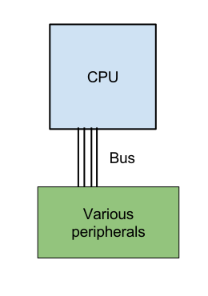

## Computer Architecture: An Overview

Note:
Goal is to discuss how computer works in general.

## Von Neumann Architecture
* Control Unit
* ALU (Arithmetic Logic Unit)
* Memory
* Input/Output

### Control Unit
Provides signal and timings.

Directs flow of data.

Typically part of the CPU.

### Arithmetic Logic Unit
Performs calculations.

### Memory
In the Von Neumann model, the memory contains both program and data and doesn't
distinguish between the two.

Typically refers to the RAM (Random Access Memory). But it can also refer to the
caches and, to some extent, secondary storage (e.g. hard disk).

### Input/Output
I/O are external sources of data, such as storage or interfaces to the user,
e.g.:

* Hard disk
* Mouse
* Monitor
* Printer

### Bus
Data lines between the different components, the most important of which is the
memory bus (connection between CPU and memory).

### Von Neumann Bottleneck
Despite the speed of the CPU and the capacity of the memory, the speed of the
computation is limited by the bus because the instructions are also stored in
memory. Instructions and data cannot be accessed at the same time because they
share a common bus.

Note: Mitigations to this problem will be discussed later.

### Current architectures are more complicated now
But they are still generally based on the Von Neumann model.

Now there are configurations where you have things such as:

* Multiple CPUs
* Multiple cores
* External processing units (e.g. GPUs)

## CPU
#### Central Processing Unit
* Controls the computer and its peripherals
* Performs most of the calculations
* Primary coordinator

### How does a CPU work?

Note: Refer to the Von Neumann Architecture

### CPU clock rate
* Controls the rate of execution
* Each clock tick represents a transition of state.
* Note that not all instructions finish in a single tick, so, externally there
  might be no state change but internally there is (transistor/gate states).

### Motherboard

_(Intel architecture)_

### Motherboard
* The motherboard binds all the peripherals together, creating an
  interconnection between the devices.
* Provides power, cooling, etc.

### Peripherals
* Has its own controller.
* DMA (Direct Memory Access)
* Hardware interrupt
* Drivers

### Hardware interrupt
* More efficient than busy-waiting.
* Interrupt-driven processing is similar to event-driven programming.

### Hardware interrupt examples
#### Keyboard
* There is a registered interrupt handler to process a particular IRQ (Interrupt
  Request). The OS usually does the registration.
* After a key press, an interrupt will be sent to the CPU.
* If there's an interrupt, the handler will be executed instead of the next
  instruction of the program currently being executed.
* The handler will read the code of the key pressed from the controller of the
  keyboard.

### Hardware interrupt examples
#### Hard disk (without DMA)
* The CPU issues a read request to the hard drive by writing to the hard disk
  controller. The specific instructions depend on the hard disk (the driver
  knows this).
* The controller reads the values in the specified address (or address range).
  The hard disk controller independently does its job while the CPU executes
  other instructions.
* When the controller is ready (the values are stored in its own registers),
  it signals an interrupt to the CPU.
* Similar to the keyboard example, a handler will be executed and the CPU then
  reads the values from the controller.

### Hardware interrupt examples
#### Hard disk (with DMA)
* With DMA, the read request comes with the specified memory location where the
  read values will be stored. So instead of storing the values in its own
  registers, it stores the read values in the memory.
* Because of DMA, the hard drive controller directly communicates with the
  memory controller instead of going through the CPU. This removes lots of
  back-and-forth communication between the CPU and the hard drive, since usually
  the values read from the hard drive are going to be stored in memory anyways.

### Instruction cycle

### Machine code
Machine code is the code directly processed by the CPU via the instruction
cycle. It is stored in the code section of the program.

Machine code consists of a series of opcodes with "arguments". Intel
architectures have variable-length opcodes.

### Assembly
Closest language next to machine code. Almost one-to-one correspondence with
machine code.

Contains different sections like the data section and the code section.

The code section contains a series of assembly instructions. Assembly
instructions (with arguments) roughly corresponds to opcodes.

### Assembly Instructions
#### Examples
* LOAD
* ADD
* SUB
* JMP

Note: JMP instructions have long and short variants, in order to account for
caches.
