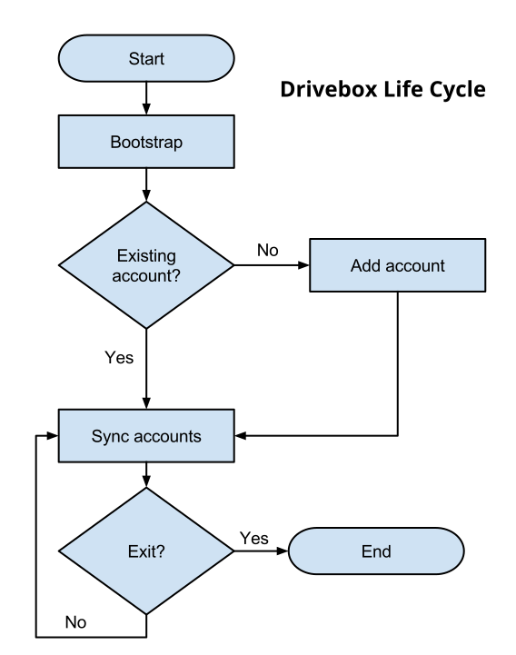

## Drivebox Code: Overview

## Life cycle

## Main components
* Core
* Platform code

### Core
* Common code
* Syncing
* Networking
* Base UI
* Etc.

### Platform code
* Initialization
* Exit
* UI
* Filesystem access
  * File watching
  * Symlink creation
* Some networking code
* Installation
* Etc.

### Platform code
#### Integrations
* System tray menu (Menubar item)
* Context menu
* Badging (icon overlay)

