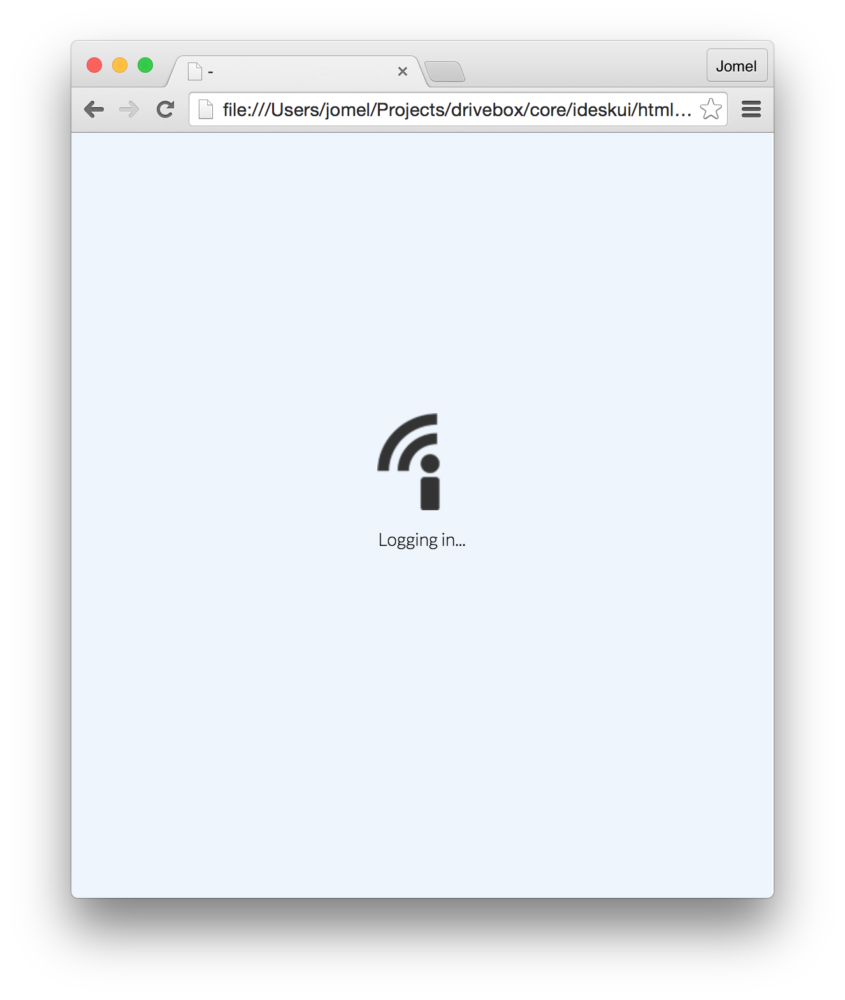
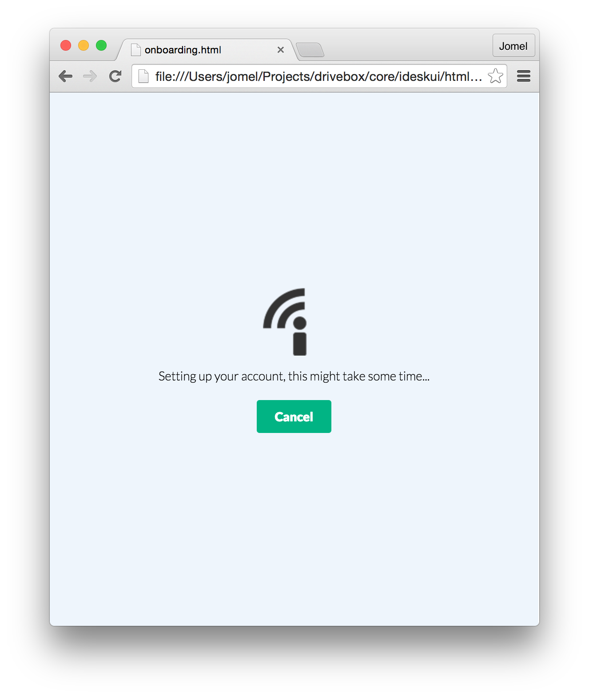
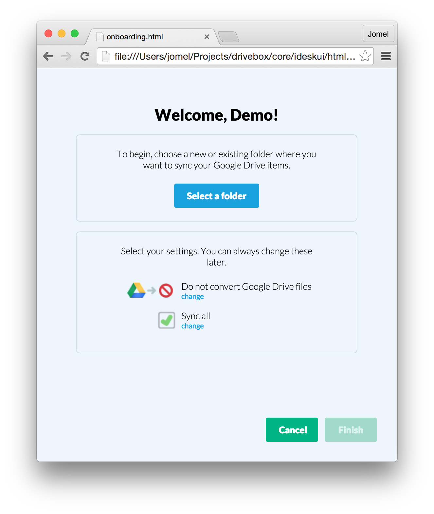
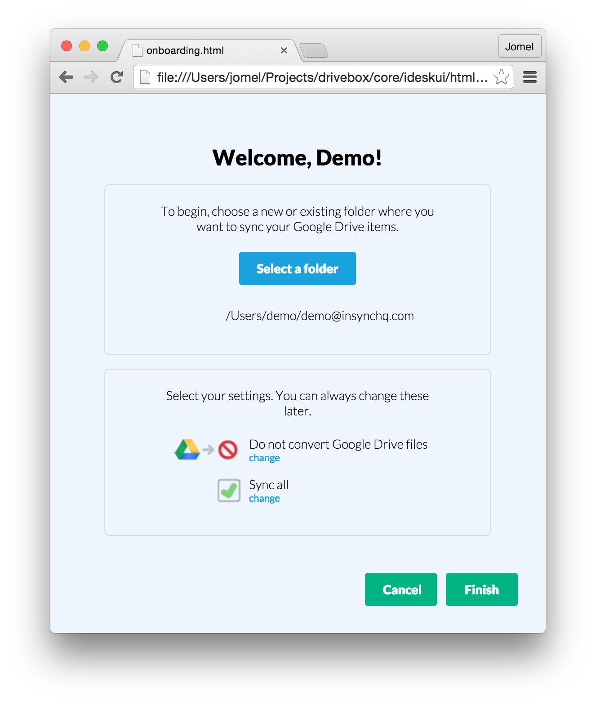
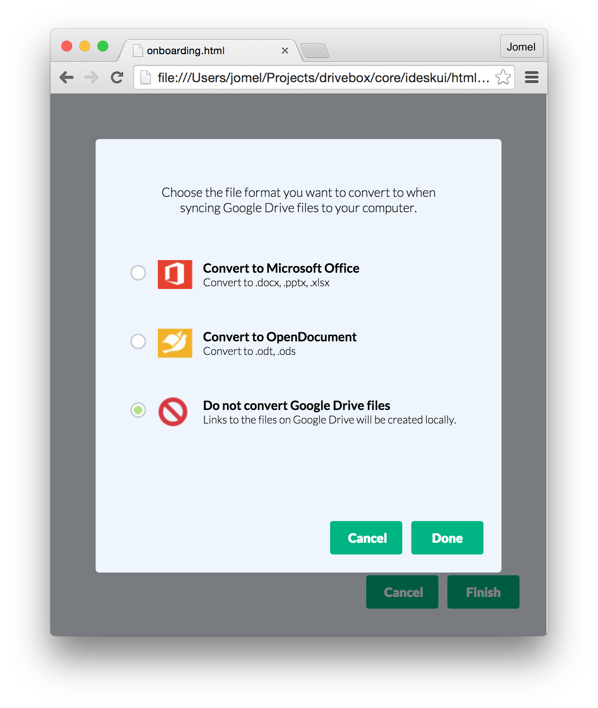
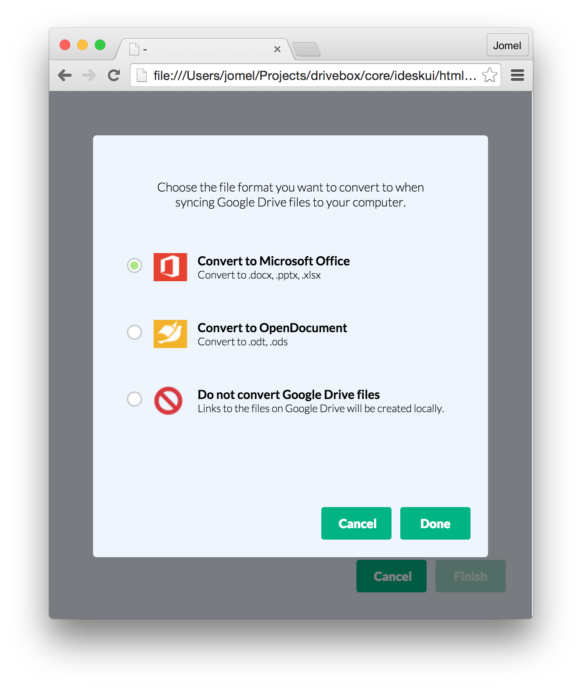
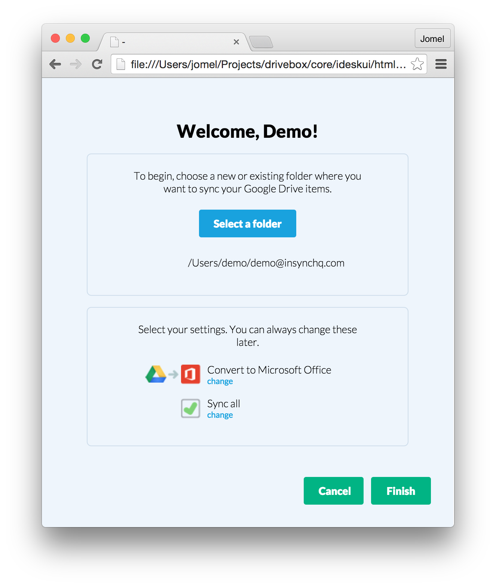
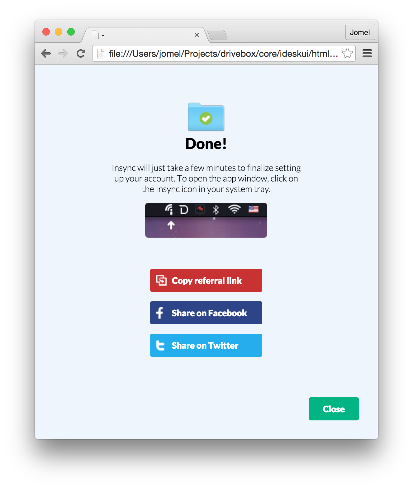

## React and Insync App UI Overview


## React: Intro
* JS library created by Facebook for building user interfaces
* Declarative style
* Break down UI into reusable, composable _components_


## React: Components
* Main building block
* f : `props`, `state` -> HTML
* Components are state machines: update state, `render` new UI based on new state
* Lifecycle hooks (e.g., `componentWillMount`, `componentWillUpdate`)


## React: Intro
* Virtual DOM
* When using React API, seems like whole app is re-rendered
* But React performs only minimum required actual DOM operations
* https://facebook.github.io/react/docs/reconciliation.html


## React: JSX
* HTML-like syntax within JS React components
* Transformed into JS (we use `browserify` during the build process)


## React: JSX
```javascript
// drivebox/core/ideskui/src/js/common/progress-bar.js

var ProgressBar = React.createClass({
  render() {
    var percent = (this.props.value / this.props.max * 100).toFixed(0)
    var barStyle = {
      width: percent + "%"
    }
    return (
      <div className="progress-bg">
        <div className="progress-bar" style={barStyle}>
        </div>
      </div>
    )
  }
})
```


## React: JSX
```javascript
// drivebox/core/ideskui/html/js/app.js

var ProgressBar = React.createClass({
  displayName: "ProgressBar",

  render: function render() {
    var percent = (this.props.value / this.props.max * 100).toFixed(0);
    var barStyle = {
      width: percent + "%"
    };
    return React.createElement(
      "div",
      { className: "progress-bg" },
      React.createElement(
        "div",
        { className: "progress-bar", style: barStyle }
      )
    );
  }
});
```


## React: JSX
* Since version 0.13, components must return only single component

```javascript
// NOT allowed:
return (
  <div>A</div>
  <div>B</div>
)
```
```javascript
// instead:
return (
  <div>
    <div>A</div>
    <div>B</div>
  </div>
)
```


## React: JSX
* Supports most common HTML tags and attributes
(http://facebook.github.io/react/docs/tags-and-attributes.html)
* Supports browser events (`onClick`, `onMouseEnter`, etc.)


## React: JSX
```javascript
// drivebox/core/ideskui/src/js/app/topbar-menu.js

render() {
  return (
    <div
      className="topbar-menu"
      onMouseEnter={this.showMenu}
      onMouseLeave={this.hideMenu}
      >
      <div className="menu-button" />
      <div className="menu" ref="menu">
        <span className="arrow-up" />
        {this.renderMenu()}
       </div>
    </div>
  )
}
```


## React: JSX
* Event delegation behind the scenes
* React event layer ensures consistency with W3C spec
* Reuse event handler functions via partial application


## React: JSX
```javascript
renderMenuItem(item) {
  return (
    <li
      onClick={this.onMenuClick.bind(null, item.id,
        item.keepMenuOnClick)}
      className={cx({
        [`${item.id}`]: true,
        'has-separator': item.hasSeparator,
        'has-icon': item.hasIcon,
        'disabled': item.disabled,
      })}
      key={item.id}
    >
      {item.text}
    </li>
  )
}
```


## React: `props`
* Immutable params passed from parent to child component
* Can only change on re-render, with parent passing new `props`
* Flows downwards
* Provided as attributes
* Accessed via `this.props`


## React: `props`
```javascript
// drivebox/core/ideskui/src/js/onboarding/onboarding.js

var Dialog = require('./dialog')

renderLoader() {
  let message = "Logging in..."
  let buttons = []
  if (this.state.loggedIn) {
    message = "Setting up your account, this might take some time..."
    buttons = [{label: 'Cancel', onClick: this.cancelInit}]
  }
  return (
    <Dialog
      message={message}
      buttons={buttons}
      loading={true}
    />
  )
}
```


## React: `props`
```javascript
// drivebox/core/ideskui/src/js/onboarding/dialog.js

render() {
  let className = cx({
    'dialog': true,
    'loading': this.props.loading,
  })
  return (
    <div className={className}>
      {this.props.loading ? (
        <div className="loader"></div>
      ) : null}
      <p>{this.props.message}</p>
      {this.props.buttons.map(this.renderButton)}
    </div>
  )
}
```


## React: `props`
* defaults can be provided in a component's `getDefaultProps`
* validation (type, required) can be performed using `propTypes`


## React: `state`
* Mutable, internal to a component (i.e., NOT shared)
* Accessed via `this.state`
* Changed via `this.setState` (and NOT directly)
* Re-render of tree will be triggered on state change


## React: setting state
* `setState` _merges_ the provided object into existing state

```javascript
getInitialState() {
  return {count: 1, active: True}
}
this.setState({count: 2}) // State is now {a: 2, b: True}
```


## React: setting state
* For nested/more complicated state, use immutability helper `React.addons.update`

```javascript
getInitialState() {
  return {
    left: {count: 1, active: True, others: ...},
    right: {count: 2, active: False, others: ...}
  }
}
// Let's say we just want to update `state.left.count`:
var newLeftState = {
  count: 2,
  active: this.state.left.active,
  others: this.state.left.others,
  ...
}
// To make it easier:
var newLeftState = React.addons.update(
  this.state.left,
  {count: {$set: 2}}
)

this.setState({left: newLeftState})
```
* Other `React.addons.update` commands are `$merge`, `$push`, `$splice`, etc.


## React: `state`
```javascript
var Release = React.createClass({
  getInitialState() {
    return {
      showChanges: this.props.current
    }
  },
  render() {
    return (
      <div className="release">
        <div className="version" onClick={this.toggleChanges}>
          <button>
            {this.state.showChanges ? "-" : "+"}
          </button>
          ...
        </div>
        {this.state.showChanges ? (
          <ul className="changes">
            ...
          </ul>
        ) : null}
      </div>
    )
  },
  toggleChanges() {
    this.setState({
      showChanges: !this.state.showChanges
    })
  },
})
```


## React: lifecycle events
* `mount` -> `update` -> `unmount`
* Hooks are provided at specific points


## React: lifecycle events
`componentWillMount`, `componentDidMount`

* `mount` = initial rendering
* Methods to perform initialization, e.g., fetching data


## React: mounting
```javascript
// drivebox/core/ideskui/src/js/app/drivebox.js

componentDidMount() {
  callPy('initialize')
  ...
}
```


## React: lifecycle events
`componentWillReceiveProps`

* Called when new `props` are to be received
* `state` can be modified here without an additional render


## React: receiving props
```javascript
// drivebox/core/ideskui/src/js/app/accounts.js

componentWillReceiveProps(nextProps) {
  if (nextProps.signed_in && !this.props.signed_in) {
    this.setMenu('main')
  } else if (nextProps.sign_in_error && !this.props.sign_in_error) {
    this.setMenu('sign-in-failed')
  }
},
...
setMenu(menu, e) {
  if (e) {
    e.preventDefault()
  }
  this.setState({menu: menu})
},
```


## React: lifecycle events
`componentWillUpdate`, `componentDidUpdate`, `shouldComponentUpdate`

* `update` = re-render in response to changed `props` or `state`
* Not called for the initial render
* `shouldComponentUpdate` can be used to optimize by preventing unnecessary re-renders


## React: updating
```javascript
// drivebox/core/ideskui/src/js/common/dropdown.js

componentDidUpdate(prevProps, prevState) {
  if (this.state.isOpen && prevState.isOpen !== this.state.isOpen) {
    var isHidden = (
      this.getDOMNode().getClientRects()[0].bottom > this.props.bottom
    )
    this.setState({
      origin: isHidden ? 'top' : 'bottom'
    })
  }
},
```


## React: lifecycle events
`componentWillUnmount`

* Called right before a component is unmounted from the DOM


## React: unmounting
```javascript
// drivebox/core/ideskui/src/js/onboarding/onboarding.js

componentWillMount() {
  this.interval = null
},
setInterval() {
  if (this.interval) {
    clearInterval(this.interval)
  }
  this.interval = setInterval.apply(null, arguments)
},
componentWillUnmount() {
  if (this.interval) {
    clearInterval(this.interval)
  }
},
...
onLinkCopied() {
  this.setState({
    linkCopied: true,
  })
  this.setInterval(this.clearLinkCopied, 2000)
},
clearLinkCopied() {
  this.setState({
    linkCopied: false,
  })
},
```


## React: refs
* Property to allow referring to a particular instance of a component


## React: refs
```javascript
// drivebox/core/ideskui/src/js/app/accounts.js

showMenu() {
  this.refs.menu.getDOMNode().style.display = 'block'
},
hideMenu() {
  this.refs.menu.getDOMNode().style.display = 'none'
},
...
render() {
  return (
    <li ...>
      <a ...>
        ...
        <div className="menu" ref="menu">
          ...
        </div>
      </a>
    </li>
  )
},
```


## React: data flow
* From parent to child: pass data as `props`
* From child to parent: pass _callbacks_ as `props`


## React: data flow
```javascript
// drivebox/core/ideskui/src/js/onboarding/onboarding.js

render() {
  ...
  return (
    <div className="main no-select">
      {this.canUseDriveFolder() ? null : (
        <h1>Welcome, {this.state.account.firstName}!</h1>
      )}
      <SelectFolder
        drive={this.canUseDriveFolder()}
        folderLocation={this.state.folderLocation}
        selectFolder={this.selectFolder}
        platform={this.state.platform}
      />
      ...
    </div>
  )
}
```


## React: data flow
```javascript
// drivebox/core/ideskui/src/js/onboarding/select-folder.js

var SelectFolder = React.createClass({
  render() {
    return (
      <div className="section select-folder">
        {this.props.drive ? null : (
          <div>
            <div className="instructions">
              To begin, choose a new or existing folder where you want to sync your Google Drive items.
            </div>
            <button onClick={this.props.selectFolder}>Select a folder</button>
          </div>
        )}
        ...
      </div>
    )
  }
})
```


## React: data flow
* _Smart_ vs. _dumb_ components
* Higher-level components hold the `state`
* Lower-level components are based solely on `props`
* _Stateful_ vs. _stateless_

In React 0.14:
```javascript
var Hello = (props) => <div>Hello {props.name}</div>;
```


## Insync UI Onboarding Walkthrough


## Insync UI: Onboarding
_Python_

* `BaseSetupDialog` in `core/ideskui/setupui.py`


## Insync UI: Onboarding
_React_

* Build script in `package.json`
* `src/js/onboarding/main.js` -> `html/js/onboarding.js`


## Insync UI: Onboarding flow


### Python
Dialog is created via `clientplat.impl.create_setup_dialog` and shown


### JS
* In `onboarding.html`, `init` is called, which sets `window.app` to be the main top-level `Onboarding` component
* Initial state has `loggedIn: false`.





### Python
`setup` is called, which initially calls `app.setLoggedIn`, then waits for the list of top-level files to be retrieved


### JS
```javascript
setLoggedIn() {
  this.setState({
    loggedIn: true,
    loginError: null,
  })
}
```





## Python
When file list has been retrieved, `app.init` is called, providing account and other info


## JS
```javascript
init(values) {
  this.setState({
    initialized: true,
    account: values.account,
    platform: values.platform,
    driveRunning: values.driveRunning,
    driveInfo: values.driveInfo,
    exportOption: values.exportOption,
    syncPartial: values.syncPartial,
  })
},
```





## JS
When user clicks to select a folder, `app.selectFolder` calls Python method `_choose_folder_path`


## Python
* `_choose_folder_path` opens platform-specific dialog to select a folder path
* After user selects a path, `set_location` is called, which calls JS method `app.onFolderSelected`


## JS
```javascript
onFolderSelected(location) {
  this.setState({
    folderLocation: location,
  })
},
```





## JS
* Let's say user wants to change conversion settings
* User clicks on `change`, which calls
```javascript
displayConvertOptions() {
    this.setState({
      overlay: 'convert',
    })
},
```


## JS
In `render`:
```javascript
switch (this.state.overlay) {
    case 'convert':
      overlay = <Convert
                  exportOption={this.state.exportOption}
                  setOption={this.setConvertOption}
                  hide={this.hideOverlay} 
                />
      break
    ...
}
...
return (
    ...
    {overlay ? (
      <div className="overlay">
        {overlay}
      </div>
    ) : null}
    ...
)
```





## JS
Clicking an export option sets `state.exportOption` of the `Convert` subcomponent to the corresponding value
```javascript
this.state.exportOption = 'ms-office'
```





## JS
Clicking Done calls the `setConvertOption` callback (passed as `props.setOption`), which sets `state.exportOption` of the `Onboarding` component





## JS
* Let's say the user is done, and clicks Finish
* This calls `done`, which calls the Python method `_done` with the currently-selected options


## Python
`_done` checks the selected options and finishes setup, calling `app.setDone` when done


## JS
```javascript
setDone(usedDriveFolder) {
  this.setState({
    done: true,
    usedDriveFolder: usedDriveFolder, 
  })
},
```


## JS
```javascript
render() {
  if (this.state.done) {
    return (<Done
              copyReferralLink={this.copyReferralLink}
              linkCopied={this.state.linkCopied}
              openFB={this.openFB}
              openTwitter={this.openTwitter}
              close={this.close}
              platform={this.state.platform}
              usedDrive={this.state.usedDriveFolder}
            />)
  }
  ...
}
```





## Next steps
* React router
* Redux: predictable state container


## Further reading
* https://github.com/mikechau/react-primer-draft
* https://facebook.github.io/react/docs/getting-started.html

